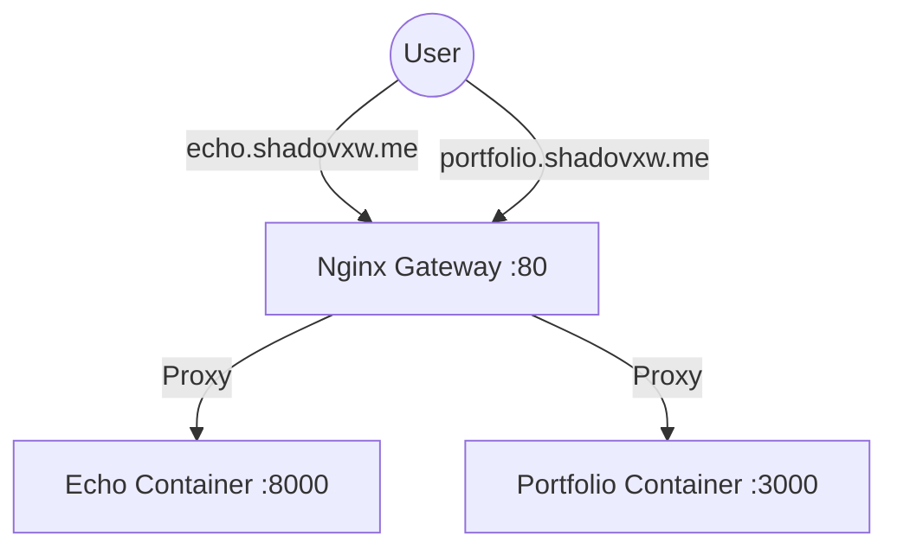

# 🚀 Microservices Gateway Setup (The "Best Way")

Since you plan to host **multiple projects** (Portfolio, Echo, etc.) on the same server, the industry-standard approach is to use a **Reverse Proxy Gateway**.

## The Architecture

1.  **The Gateway (Nginx on Host):** Sits on Port 80/443. It receives ALL traffic and routes it based on the domain name.
2.  **Your Apps (Docker Containers):** Run on unique "high ports" (e.g., 3000, 8000, 8001) or internal networks.



---

## 1. Prepare Echo (Done)
We configured Echo to run on port **8000**.
- **URL:** `http://localhost:8000` (Internal)

## 2. Prepare Portfolio
Ensure your Portfolio is running on a specific port (e.g., 3000) and **NOT** binding port 80 directly. If it's a Docker container, update its compose file:
```yaml
ports:
  - "3000:3000" # Instead of 80:80
```

## 3. Configure the Nginx Gateway

You will create a separate config file for each project in `/etc/nginx/sites-available/`.

### Config for ECHO (`/etc/nginx/sites-available/echo`)
```nginx
server {
    server_name echo.shadovxw.me;

    location / {
        proxy_pass http://localhost:8000;
        proxy_http_version 1.1;
        proxy_set_header Upgrade $http_upgrade;
        proxy_set_header Connection 'upgrade';
        proxy_set_header Host $host;
        proxy_set_header X-Real-IP $remote_addr;
        proxy_set_header X-Forwarded-For $proxy_add_x_forwarded_for;
    }
}
```

### Config for PORTFOLIO (`/etc/nginx/sites-available/portfolio`)
```nginx
server {
    server_name portfolio.shadovxw.me shadovxw.me;

    location / {
        proxy_pass http://localhost:3000; # Change to your portfolio's port
        proxy_http_version 1.1;
        proxy_set_header Upgrade $http_upgrade;
        proxy_set_header Connection 'upgrade';
        proxy_set_header Host $host;
    }
}
```

## 4. Enable Sites & SSL

1.  **Enable configs:**
    ```bash
    sudo ln -s /etc/nginx/sites-available/echo /etc/nginx/sites-enabled/
    sudo ln -s /etc/nginx/sites-available/portfolio /etc/nginx/sites-enabled/
    ```

2.  **Test & Reload:**
    ```bash
    sudo nginx -t
    sudo systemctl reload nginx
    ```

3.  **Get Free HTTPS (Certbot):**
    ```bash
    sudo apt install certbot python3-certbot-nginx
    sudo certbot --nginx
    ```
    Select "All Domains" to automatically secure both sites! 🔒
